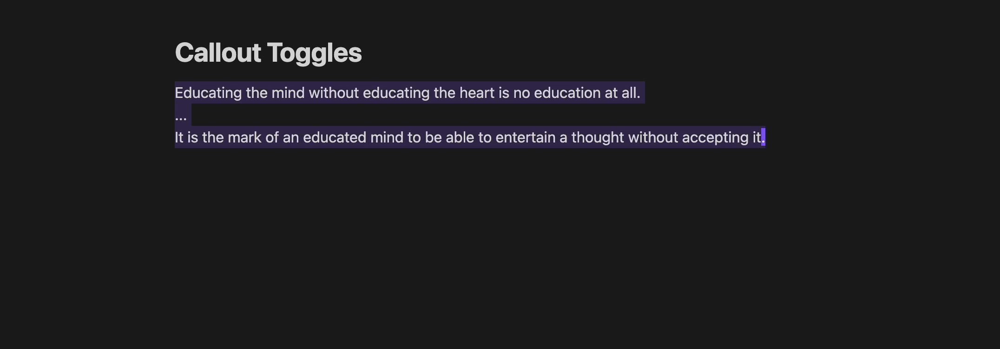
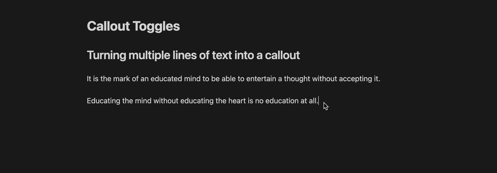
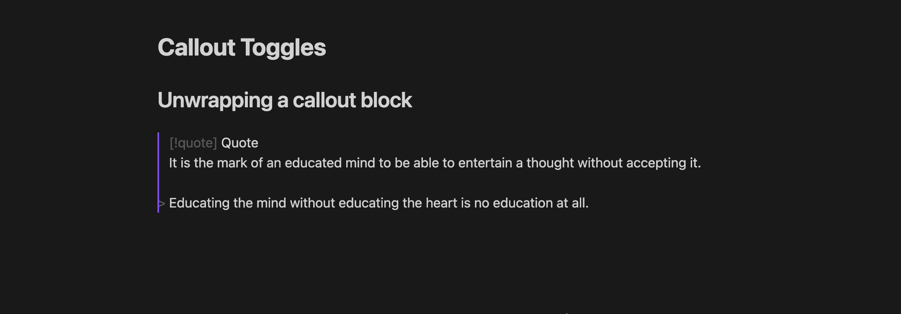
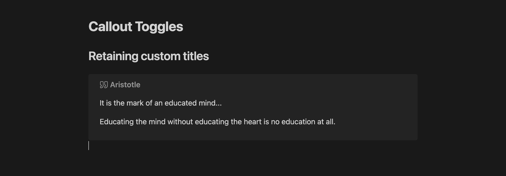
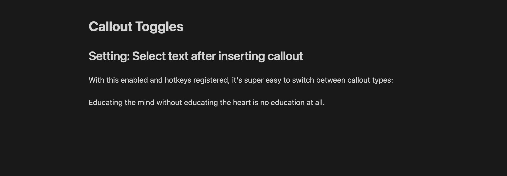

# Callout Toggles

An [Obsidian](https://obsidian.md/) plugin for quickly adding and removing callout wrappers to/from selected lines of text.

## Table of contents

- [Callout Toggles](#callout-toggles)
  - [Table of contents](#table-of-contents)
  - [Commands provided](#commands-provided)
  - [Usage](#usage)
    - [Inserting a fresh callout block](#inserting-a-fresh-callout-block)
    - [Wrapping the current line](#wrapping-the-current-line)
    - [Turning multiple lines of text into a callout](#turning-multiple-lines-of-text-into-a-callout)
    - [Unwrapping a callout block](#unwrapping-a-callout-block)
    - [Retaining custom titles](#retaining-custom-titles)
  - [Available settings](#available-settings)
    - [Select text after inserting callout (default: off)](#select-text-after-inserting-callout-default-off)
  - [Callout Manager integration (custom callouts)](#callout-manager-integration-custom-callouts)
  - [Related plugins](#related-plugins)
  - [Appreciation](#appreciation)

## Commands provided

1. **Wrap lines in [X] callout**
2. **Remove callout from selected lines**

One `Wrap lines in [X] callout` command is provided for each callout type (bug, info, warning, question, tip, quote, etc.), so that you can assign separate hotkeys for each of your favorite callouts.

## Usage

### Inserting a fresh callout block

To insert a fresh callout block of your choice, simply run `Wrap lines in [X] callout` on a blank line:

### Wrapping the current line

If the current line is not blank and nothing is selected, the current line will be included in the callout:

### Turning multiple lines of text into a callout

To turn multiple lines of text into a callout of your choice, first select the lines, and then  run `Wrap lines in [X] callout`. Note that the wrap command works on full lines; so as long as part of a line is selected, the entire line will be included in the callout:

### Unwrapping a callout block

To turn a callout back into regular text, run the `Remove callout from selected lines` command with the given lines selected:

Note that the callout must begin on the first selected line of text for this command to be available.

### Retaining custom titles

If a callout has a default title (e.g. `> [!quote] Quote`), the entire header line will be removed when calling `Remove callout from selected lines`. If a custom title is present (e.g. `> [!quote] Aristotle`), it will be retained as a Markdown heading, so that you don't lose your hard work in choosing that title.

If you call `Wrap lines in [X] callout` on a selection whose first line is a Markdown heading, the heading will be used as the custom title for the new callout block:

## Available settings

### Select text after inserting callout (default: off)

When enabled, callout text will be automatically selected after insertion, even if no text was initially selected. Keep this setting disabled if you'd prefer to be able to immediately start typing content after adding a fresh callout. Enable this setting if you'd prefer to be able to immediately run `Remove callout from selected lines` instead (useful for switching between callout types):

## Callout Manager integration (custom callouts)

This plugin automatically integrates with the [Callout Manager](https://github.com/eth-p/obsidian-callout-manager/) plugin, if you have it installed. This means that the callout types available in this plugin will be automatically synced with your custom callout types in Callout Manager.

If you don't have Callout Manager installed, [no worries](https://www.youtube.com/watch?v=4P-YBqVzJg0)—this plugin will still work as expected. A default set of callout types will be available for you to use.

## Related plugins

As mentioned above, you can use the [Callout Manager](https://github.com/eth-p/obsidian-callout-manager/) plugin to customize how Obsidian handles callouts (adjust callout colors/icons; add your own custom callouts; etc.).

If you'd like a single command that prompts you with a dropdown of callout types, I'd recommend also installing the [Callout Suggestions](https://github.com/cwfryer/obsidian-callout-suggestions) plugin.

## Appreciation

Thanks to the creators of Obsidian, seriously an awesome note-taking app! And big thanks to [eth-p](https://github.com/eth-p/) for providing a [Callout Manager API](https://github.com/eth-p/obsidian-callout-manager/tree/master/api)—super cool.
